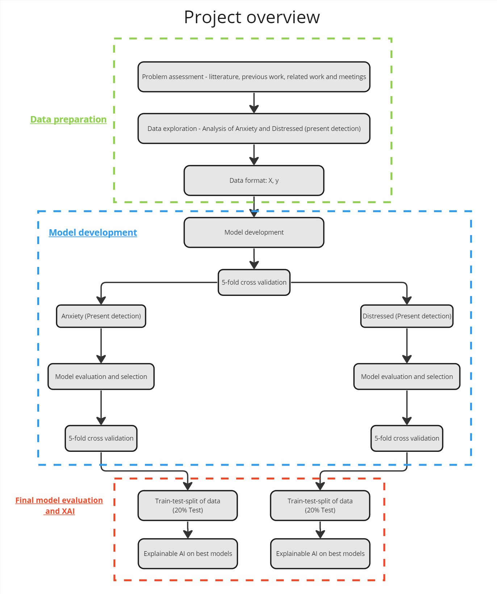
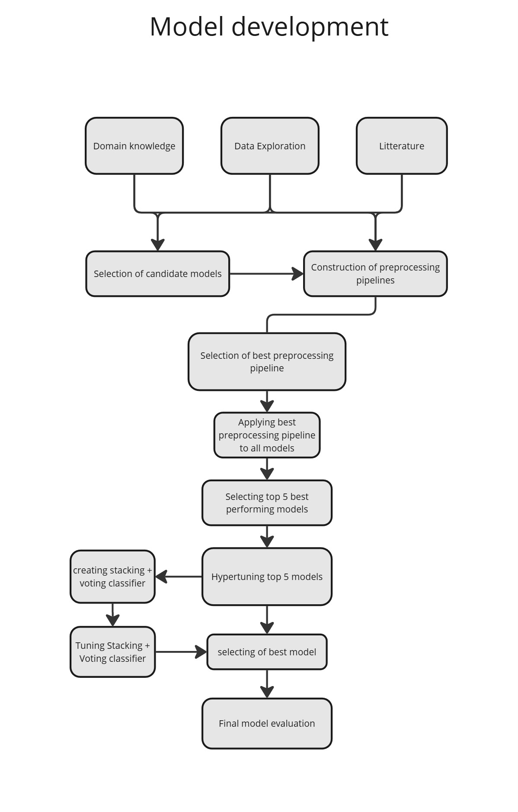
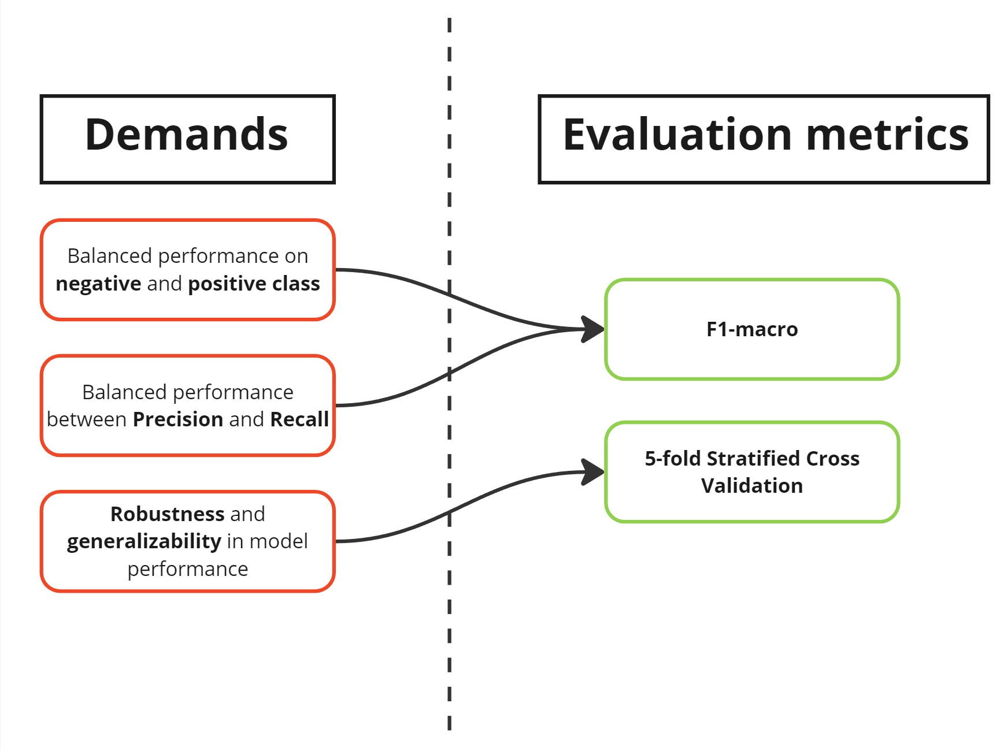
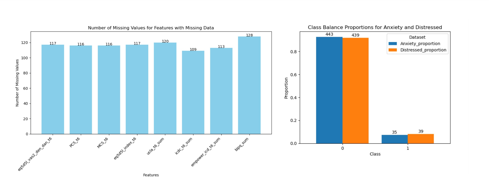
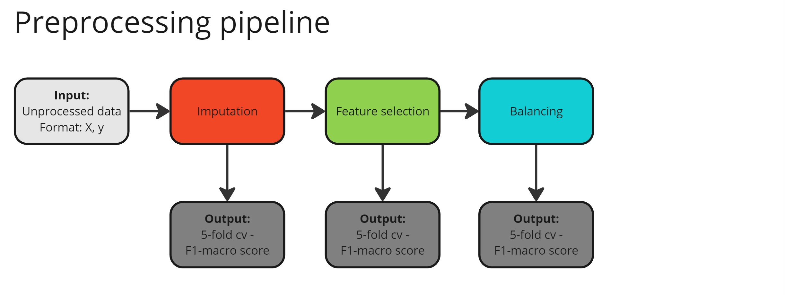
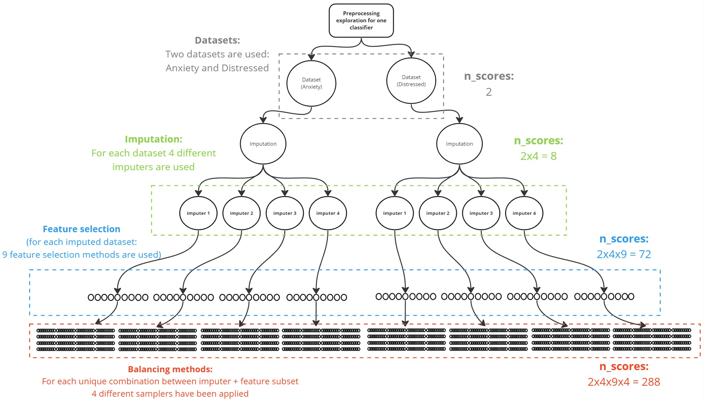
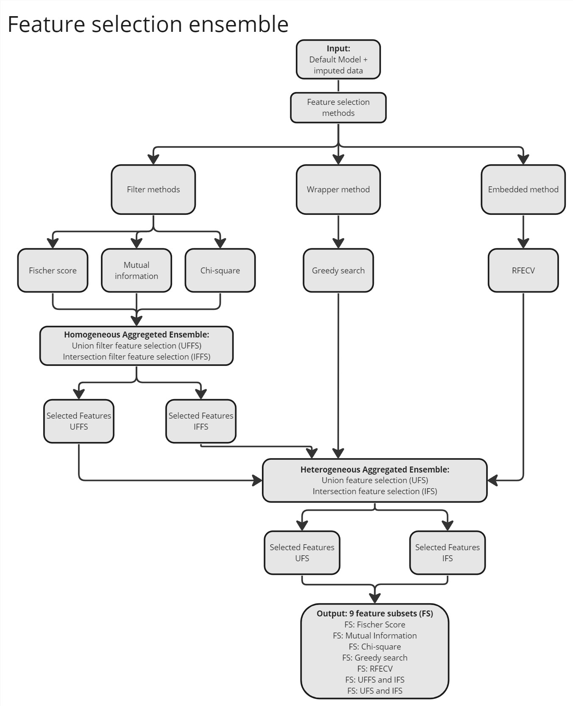
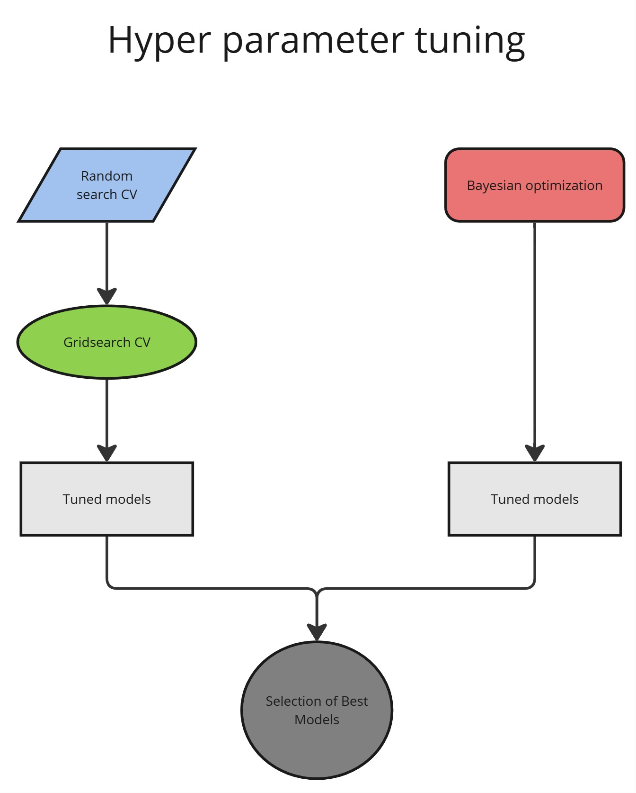
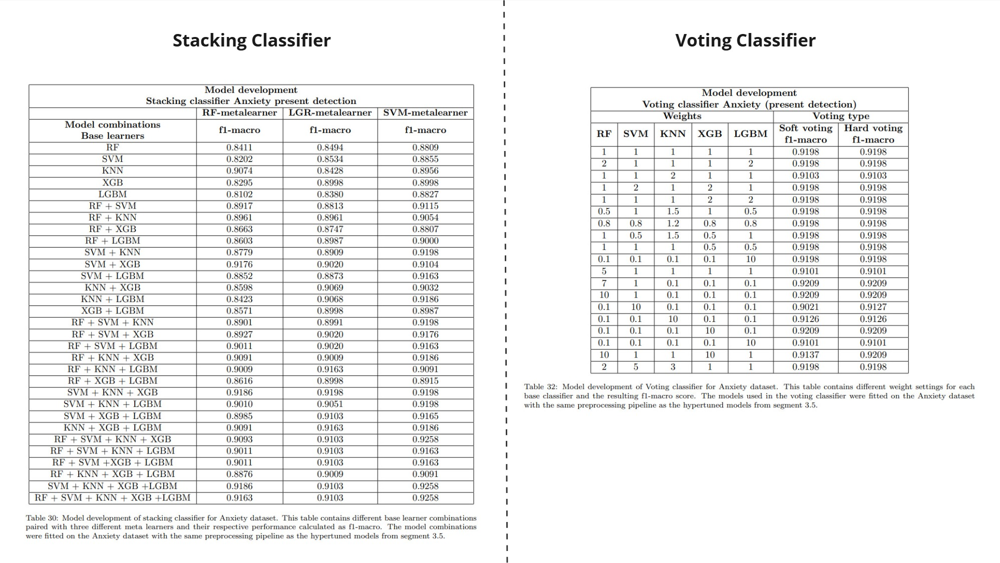

# ML_algorithmic_development_mental_disease_prediction

## About this project
### Type of project/purpose of repository
This project is mainly a Data science project with the overall purpose of developing complex Machine-learning pipelines to iteratively improve classification performance for monitoring heart patient's mental state.

The purpose of this repository is to showcase the usefullnes of using ML for classifying mental health issues using patient-reported and demographic data. This project also reflects a special emphasis on solving problems related to real-world data, more precisely, working with smaller datasets with serious problems related to missing values, etc. 

The overall emphasis will be to explain the key concepts and thoughts about the algorithmic development through visualization and code in this README-file.

### Project contributors and credits
This project is the outcome of three sequantially carried out master thesis projects from Syddansk Universitet (SDU), that has been developed over a two year period. The project is a part of a larger initiative that has been presented by the ACQUIRE-ICD foundation which is a collaboratory research-based project managed by OUH and SDU, which aims to increase patient related outcomes in relation to heart patients. For more information about this project and its organization see [ACQUIRE-ICD](https://www.sdu.dk/en/om-sdu/instituttercentre/institut_psykologi/forskning/forskningsprojekter_/acquire-icd).
 
The main authors of the final rendition of the project which is presented here are Jakob Eriksen and David Krogh Kølbæk. However this project is greatly influenced by our former supervisors Uffe Will and Ali Ebrahimi, which have provided continuous feedback on key processes related to project management and ML-based development. The earlier iterations of this project has been carried out by Jonas Pedersen and Ebbe Christensen. Also a special thanks is givin to the phycological department of OUH which have provided great feedback on clinical variables through their extensive domain knowledge. 

### Practical circumstances
Important notice: The exact dataset that have been used for this project is not sharable since it contains sensisitve patient information and cannot be assessed without special authorization from Odense Universitets Hospital (OUH). If one wishes to work further on this project it is recommended to contact Odense Universitets Hospital and ask for the ACQUIRE-ICD project.

The general dataformat and a visualization of what variables have been used will still be presented to showcase what type of data will work for development of ML-pipelines.

### Background/problem
With the increasing prevalence of mental illnesses and the increasing pressure of the healthcare system in general, there is a need for more effective procedures and automation. Machine learning can be applied and also act as a decision support tool for practitioners to ease the task of diagnosing patients. The main ideas and takeaways from incorporating machine learning into the health care system are increasing the quality of the health care the patients receive, whilst also decreasing the workload for the clinicians through the analytical predictive power of machine learning. However, the machine learning algorithms utilized will also need to be transparent and explainable for the benefit of both the clinicians and the patients. This highlights the importance of utilizing Expainable AI (XAI) to ensure clinical demands in relation to algorithmic decision making.

Common problems that clinical classification algorithms face in a real-life scenario typically revolves around the datasize and missing values. This was also the case for the type of data used for this project. Therefore the main essentitive of some of the earlier stages is on efficient handling of these issues.

In relation to the project scope and highlighted problems, the main topics that will be showcased are:
- Preprocessing and data-preparation strategies.
- Tuning and selection of ML-models.
- Construction of Ensemble models in the form of Voting and Stacking classifiers.
- Model evaluation strategies.
- Usage of XAI for model transparency.

### Project solution
The general overview of the project solution can be seen on the figure below:

The project flow is divided into three stages, Data preparation, Model development and Final model evaluation and XAI. For context, the model development phase is divided into two branches. The branches represent a parallel development of models on two different datasets. This is due to certain circumstances in relation to this specific project and the processes applied are identical for each branch. If you only have one dataset then just apply the steps highlighted for one branch. 


## How to run this project / Requirements
Important notice: Some of the processes in this project have been catered to a very specific instance of data variables and might not be best practise for data in other formats. Therefore, it is recommended to consider the general outline of the data variables that have been used and take the data-format into context and consideration when creating your own project.

### Setting Up the Project

1. **Clone the Repository**: Start by cloning the GitHub repository to your local machine:
    
    ```
    git clone <repository_url>
    cd <repository_directory>
    ```
    
2. **Set Up a Virtual Environment** (optional but recommended): Create a virtual environment to manage the dependencies.
    
    ```
    python -m venv env
    env\Scripts\activate
    ```
    
3. **Install Dependencies**: Use the `requirements.txt` file to install all the required libraries.
    
    ```
    pip install -r requirements.txt
    ```
    
4. **Jupyter Notebook Installation**: Since the project is developed in Jupyter notebooks, ensure that Jupyter is installed. You can install it with:
    
    ```
    pip install jupyter
    ```
    

### Running the Project

1. **Launch Jupyter Notebook**: To run the project, start Jupyter Notebook from the command line:
    
    ```
    jupyter notebook
    ```
    
    This command will open Jupyter in your default web browser. From there, navigate to the notebook files of the project.
    
2. **Select the Notebook**: Open the specific notebook(s) you want to explore. Each notebook will contain data preprocessing steps, model training, evaluation, and visualization.
3. **Run Cells**: Run each cell in the notebook sequentially to reproduce the analysis. Ensure that the data files are in the appropriate locations as mentioned in the notebook. The precise details of the data that have been used will be explained in another segment. Important notice: The exact dataset that have been used for this project is not sharable since it contains sensisitve patient information and cannot be assessed without special authorization from Odense Universitets Hospital (OUH). 

4. **Data format**: The input variables to all the pipelines in this project should be in tabular format, e.g. consists of n-columns representing features with n-rows representing instances. Missing values are acceptable and will be handled by the algorithms. Due to some manual configurations, the dataset must not contain less than 10 features since some of the feature selection processess will become redundant due to limitation of usage and their general purpose will be invalidaded. 


## ML-development process
This segment aims to describe the key concepts behind the choices made in the model development phase and explain the theoretical approach in relation to the code files. The overall Model development  process is summarized on the following figure:


The first part of the figure higlights the usage of Domain knowledge from the clinicians from OUH, Data eksploration done by statistically means and then a litterature search. This is used to define the type of ML-models to use and construct meaningful preprocessing pipelines. In other words, when starting your own project it is very important to gather all the essential knowledge before working on the actual solution. The step "Selection of best preprocessing pipeline" is essentially: For each candidate model, the best combination of preprocessing methods (Imputation, Scaling, Feature selection, balancing), will be used in the later processes. Now the main idea is to use this pipeline on the rest of the candidate models and then select the top 5 models performing models. The insentive behind doing this is that the preprocessing pipeline have to be the same when using multiple models in a Voting/stacking classifier which is one of the later steps that can be seen on figure. Now before the stacking and voting classifier is developed, the top 5 models from the preprocessing step are hyperparameter tuned. Now the selection of the best models will be between the ensemble models (stacking/voting) and the individual models. The overall best model will be passed on to the last phase of the Model-development phase which is the final model evaluation. 

### Dataset information
The dataset that has been used for this project is as mentioned private data that cannot be accessed without authorization from OUH. However to provide clarity on the key decisions and strategies applied, the general information and structure of the data will be explained in this segment. 

Dataset information:
- The dataset has 478 samples representing 478 unique heart patients.
- There are two unique instances of the dataset, one with labels for representing Anxiety, and one with labels representing Distress.
- The two different instances uses the same input features but is processed individually and in parallel.
- The class balance is roughly 8-10% positive cases (patients with mental illness) to 90% healthy patients.
- The dataset contains 39 unique features (mix of patient reported meassures and demographic data).  

### ML-models
The choice of ML-models that have been tested in this project is based on a litterature search which focused on the medical domain in order to choose relevant and robust models. Furthermore, there was emphasis on choosing models that are very different in nature due to the need for creating ensemble models in later stages of the project. It is recommended to select the models based on domain knowledge and to consider the practical purposes behind the real-life circumstances.

With these factors in mind the selected models for this project are:
- Random Forest Classifier (RF)
- Support Vector Classifier (SVC)
- K-nearest Neighbor Classifier (KNN)
- Multi-layer Perceptron (MLP)
- Xtreme boosting gradient Classifier (XGBoost)
- Naive Bayes (NB)
- Light Gradient Boosting Classifier (LGBM)
- Decision Tree Classifier (DTC)
- Logistic Regression Classifier (LGR)
These models will be refered to as the "candidate models" from here on out.

### Evaluation strategy
It is important to know why and how evaluation metrics are used for your project. In this case the choice of metrics is dependent on the demands to ML-models in clinical context. In this project we want a model that performs great on both the positive and negative class. Putting it into context if we develop a model that produce false positives, patients would experience alot of inconvenience, whereas if the model produced alot of false negatives, it would miss patients and the consequences could be dire. This is essentially a question of priortities and it is often not possible to achieve the ideal model that is very sensitive without making false positives. However, since our aims is to produce a balanced model we will use the F1-macro score that weights both precision and recall but also emphasized the negative and positive class. This is especially important when the dataset is very imbalanced, since the model performance could look optimistically good for the negative class due to its sheer size compared to positive class. Another thing to avoid is creating a model that only performs good at the positive class. Furthermore since the dataset that is used in this project is very small, it is needed to perform cross validation to ensure robustness and generalizabilty in the model development phases. This is in other words to avoid overfitting the models. 

A summary of the demands to the algorithms and the solution in terms of evaluation metrics can be seen on the figure below:


### Preprocesssing
The general approach to the preprocessing is based on the problems identified for the particular dataset that has been used. The dataset contains the following problems that needs to be addressed:
- Missing values
- Small dataset size
- High number of features in relation to size
- Severe class imbalance

**Dataset characteristics**

The specific problems of the dataset can be seen on the following figure:


**Singular Preprocessing Pipeline**

To address these problems, the following approach is proposed:


Each of these steps in the preprocessing pipeline has a fairly complex methodological approach behind them and is pieced together to form a robust and iterative approach to finding the most optimal solution. This process will be refered to as "Preprocessing exploration" and contains the whole preprocessing pipeline in relation to each model candidate. This process is depicted and summarized on the following figure in the next segment.

Now the selected methods for preprocessing all share the same pattern and thought process. We introduce both simple and complex algorithms/methods to ensure that we try out both simple and complex solutions. This is important because it can be very hard to determine the difficulty level of the classification task. One could ask themselves: What level of complexity do my methods and models need to achieve the best solution? This is ofcourse very cryptic and is often not known before hand. Anyways, the exact methods used is listed here:

Imputation:
- Simple Imputer
- KNN Imputer
- Iterative Imputer
- Iterative Imputer with RandomForest as regressor

Scaling:
- Standard Scaler
- MinMax Scaler
- Robust Scaler
- Quantile Transformer

Feature Selection:
- Fischer Score
- Mutual Information
- Chi-squared
- Forward Greedy Search
- Recursive Feature Elimination
- Union Method
- Intersection Method

Balancing/samplers:
- Random Undersampler
- Random Oversampler
- SMOTEEEN
- SMOTETomek


**Preprocessing Pipelines Ensemble**

The following figure depicts exactly "How" the listed preprocessing methods from the earlier segment is used in conjunction to form a comprehensive and exhuastive search. The figure of this exact process can be seen below: 


The main concept behind the figure is to use the different preprocessing methods in layers. In this project, four different imputing strategies are utilized, 9 different feature subsets based on feature selection processes and 4 balancing methods. The question is now, how do we know which combination of methods will yield the best results? And how do we take interactive effects between different preprocessing steps into account? The solution in this project is to brute-force all possible combinations of the best identified methods which was found during literature search. The figure above, takes two datasets into account as mentioned earlier. However if we follow one branch we can see that we get 144 unique pipelines when we end out in the Balancing methods bracket. This is only for one model and this process must be repeated for all candidate models that are selected. An important notice is to apply imputation, then feature selection and in the end balancing. This is to avoid data-leakage in some of the methods used during the pipelines. 

**Feature Selection Ensemble**

Both the imputation and balancing bracket (green and red box on above image) consists of singular methods that is tried once for each pipeline iteration. However the Feature selection bracket (blue box), is visualy more simplified and is in reality an example of different feature selection methods that dynamically select the feature subset from a set of 9 for each pipeline iteration. The process of finding the most optimal features can be very challenging and be very dependent on the dataset characteristics and models chosen. To compensate for interactive effects between features and other preprocessing methods this step is included in the preprocessing pipeline.

To provide further clarity on the functionality, the following figure is provided:


On the figure it can be seen that the feature selection ensemble contains different methods to find the most optimal features. Filter, wrapper and embedded methods are utilized. The filter methods aims to find the best features by utilizing different statistical aspects like Fischer score, Mutual information and Chi-square. The wrapper method consists of a Forwards greedy search algorithm and the embedded method is the well-known RFECV which is implemented by sci-kit learn. In general the feature selection algorithms perform the feature selection on principles such as between/within class-variance, observed and expected frequency, information gain and dependency between variables and feature importances. This ensures that different aspects of the dataset is taken into account when selecting the features and thus ensuring a more robust selection process. The second level consists of a homogeneous aggregated ensemble which computes the union and intersection of the output features from the three filter methods from the first layer. Furthermore, in the second layer there is a heterogeneous aggregated ensemble which accepts the output from the homogeneous aggregated
layer, the wrapper methods (Forward Greedy Search) and the embedded method (RFECV). This layer also produces an union and intersection of the features found from the different layer and FS methods. The main idea behind using the intersection and union between the different feature selection methods is to combine the strengths of multiple techniques while reducing the risks of individual biases.

### Hyperparamterer tuning
Hyperparemeter tuning is a highly iterative and time-consuming task. In this project the main focus was to try out different approaches to cross-validate and experiment with whether the most optimal solution was found. The best hyper-parameters is very dependent on the models that are used and the most optimal solution might differ greatly between datasets. Therefore this process is often not documented clearly in most litterature but I will showcase our main approach to solve this task. Based on the results that was found in the preprocessing step, only 5 of the models is used in the hyperparameter tuning step. In general the idea is to remove models that perform drastically worse since even hyperparameter tuning can't make them better than the already best performing default models. This is also to cut down on the computational cost of running these algorithms.

The following figure depicts the overall hyperparameter tuning process used in this project:


As seen on the figure, three different methods have been used, RandomSearchCV, GridSearchCV and Bayesian optimization. These hypertuning methods have very different purposes and as such different strengths and weaknesess. In this case the RandomSearch which is less time consuming than the brute-force method Gridsearch is actually used beforehand to gain some intuition about what parameters that might work. These findings is then used to scope out the parameter ranges for the Gridsearch algorithm which will exhaustively try out every combination in the parameter ranges. The second branch on the image is the bayesian optimization method. The general idea about adding this is to have a more sophisticated/intelligent methold that converges towards the most optimal solution by using previous iterations. In the end the results found from this branch will be compared to the first branch. Each of the 5 selected candidates models, selected from the preprocessing stage, will be hyperparameter-tuned by the process depicted on the figure above.

### Construction of Stacking/Voting classifiers
THe main concept of using stacking/voting classifiers is to make more robust and better performing classifiers. Each individual model has its own strengths and weakness. Now for the stacking classifier these invidual models can be called base-learners and the idea is to train a Meta-learner by using the predictions from the base-learners as input to the meta learner. The main approach is to select base-learners that are very different in nature in order to get variety in the trained models and the insigts they bring to the predictions. In this way the base-learners might be able to compensate for each others weaknesses and maybe learn more of the underlying patterns in the training data. However it is important to mention that this increases the complexity and computational cost of the algorithm drastically. The Predictive gain should match the increase in computational cost. This is in the end a decision that the creator must make and it is also very dependent on the implementation requirements and the use-case for the ML-algorithm. 

The Voting classifier is a more simpel alternative to the stacking classifier. It uses multiple models aswell but it doesn't train a meta-learner. It works by looking at each prediction of the base-learners and then it either does a Hard or Soft-voting. Anyways, this method is used to test whether a more simple ensemble method might produce better results. (this is still in relation to the need to discover the complexity of the classification task). 

Now in order to document the development process for the Stacking and Voting classifier I will present a table of the results used in this project:


The main concept behind the Stacking classifier development can be seen on the figure above. We have a column representing model combinations and for here we iteratively try out base-learner combinations that gets increasingly more and more complex. Now we have a range of simple to fairly complex model combinations. This is done for three different meta-learners which are the RF, LGR and SVM-metalearners. The Voting classifier is a bit more simple and here we adjust weights that are assigned to each of the models in the voting-ensemble. 

### Model evaluation
### XAI 

## Code implementation
### Overview of development steps (codefiles)
Explain the environment the code was build and executed in - Ucloud, computational ressources. 
Explain what each file do in general and in order.

1: pipeline preproccesing
2: Scaling
3: all_tuned_models
4: stacking_voting
5: metrics_final_models
6: shap

Explain what the purpose of each file is. 
